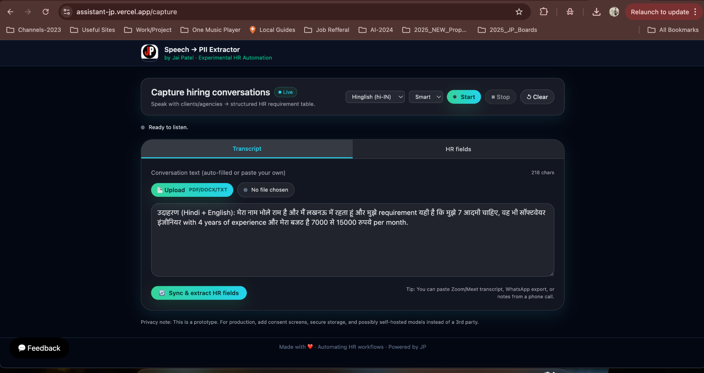
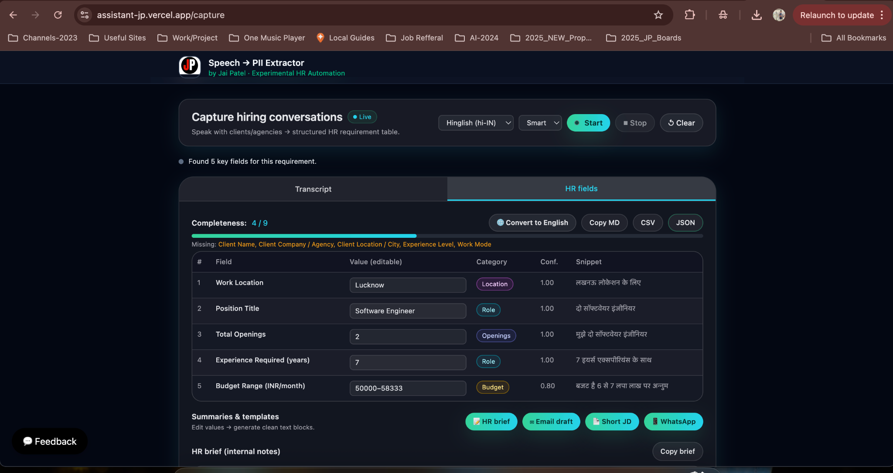
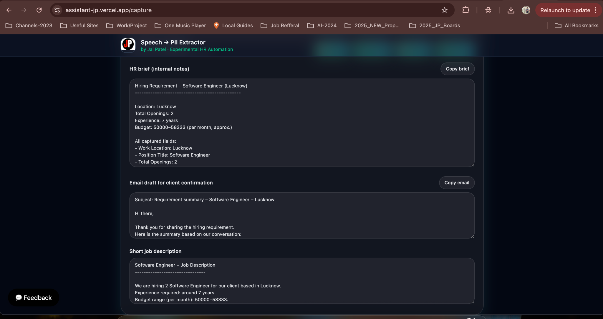

# HR Assistant – Voice to Job Description & Hiring Summary

## Overview
This project is an AI-assisted HR workflow tool that converts unstructured hiring conversations into structured, editable, and exportable hiring artifacts.

Recruiters or hiring managers can:
- Speak requirements
- Paste call transcripts or notes
- Upload documents
- Instantly generate structured HR data, emails, and job descriptions

The goal is to **reduce manual HR effort**, eliminate miscommunication, and standardize requirement capture.

---

## Problem Statement
Hiring requirements are often captured via:
- Phone calls
- WhatsApp messages
- Zoom / Meet conversations
- Informal notes

This leads to:
- Missing or inconsistent information
- Repeated clarification calls
- Manual drafting of emails and JDs
- Loss of context across teams

---

## Solution
The HR Assistant captures raw hiring input and transforms it into structured outputs:

- Extracted HR fields (role, location, budget, experience, etc.)
- Editable requirement table with completeness indicators
- Auto-generated:
  - HR brief (internal notes)
  - Client confirmation email
  - Short Job Description
  - WhatsApp-ready message
- Export formats: CSV, JSON, Markdown

The system highlights missing fields to improve requirement quality before sharing.

---

## Key Features
- Text, paste, file upload, and voice input
- Multi-language support (default: Hindi-EN / Hinglish)
- One-click extraction into structured HR fields
- Editable tables with confidence scores
- Missing-field warnings for incomplete requirements
- Export options: CSV, JSON, Markdown
- Light, Dark, and Smart theme modes
- Embedded feedback widget for continuous improvement

---

## Architecture Overview

### High-level Flow

The frontend remains stateless.  
All AI processing and enrichment is handled via API routes and an external backend service.

---

## Engineering Decisions
- Used Next.js App Router for co-located UI and API logic
- Kept extraction logic stateless and repeatable
- Prioritized human review by keeping outputs editable
- Highlighted missing fields instead of forcing assumptions
- Separated UI concerns from backend integrations

---

## Trade-offs & Limitations
- No persistent database for requirement history
- Designed for single-session usage
- Not optimized for high-volume enterprise usage
- Assumes user review before sharing outputs

These trade-offs were intentional to keep the tool lightweight and transparent.

---

## Data & Privacy Notes
- This is a prototype and case study
- No authentication or long-term storage
- Voice and text inputs are processed transiently
- For production use, consent screens and secure storage would be required

---

## Future Improvements
- Recruiter accounts and saved history
- Team collaboration on requirements
- Custom extraction templates
- ATS integrations
- Self-hosted model options

---

## Screenshots

### Step 1 – Capture Hiring Input

### Step 2 – Structured HR Fields

### Step 3 – Generated Outputs

---

## Status
This project is maintained as a **public technical case study** demonstrating AI-assisted workflow automation for HR and recruitment use cases.
