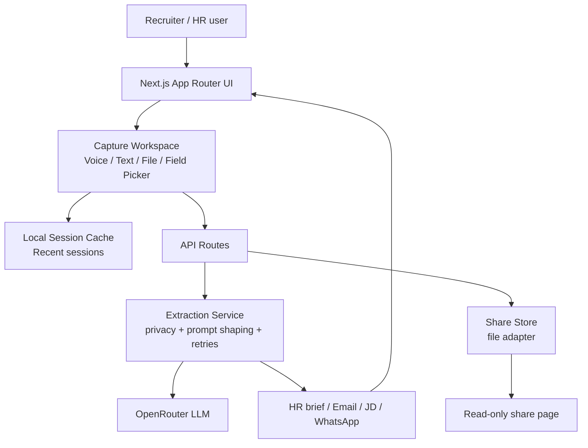

## Updated architecture

### UI layer

- `app/page.tsx`
  - Lightweight SaaS landing page
- `app/capture/page.tsx`
  - Main recruiter workspace
  - Consent state
  - Dynamic field selection
  - Session restore
  - Share-link creation
- `app/share/[shareId]/page.tsx`
  - Read-only delivery view for shared sessions

### Shared product logic

- `lib/hireflow/fields.ts`
  - Predefined field catalog
  - Custom field creation
  - Session title helpers
  - Row ordering
- `lib/hireflow/privacy.ts`
  - Sensitive-pattern scanning
  - Redaction before AI calls
- `lib/hireflow/output.ts`
  - HR brief
  - Email draft
  - JD enhancement
  - WhatsApp summary

### Server modules

- `lib/server/openrouter.ts`
  - Shared AI client
  - Retry logic
  - JSON parsing helper
- `lib/server/extract.ts`
  - Dynamic extraction prompt generation
  - Suggested-field support
- `lib/server/transliterate.ts`
  - Transliteration wrapper
- `lib/server/rate-limit.ts`
  - Basic in-memory throttling
- `lib/server/logger.ts`
  - Structured console logging
- `lib/server/share-store.ts`
  - File-backed adapter for read-only share sessions

## Recommended next step for full SaaS hardening

1. Replace the file adapter with a real database.
2. Add authentication and tenant-aware session ownership.
3. Move rate limiting to Redis or gateway middleware.
4. Add audit logs and signed share links with expiration.
